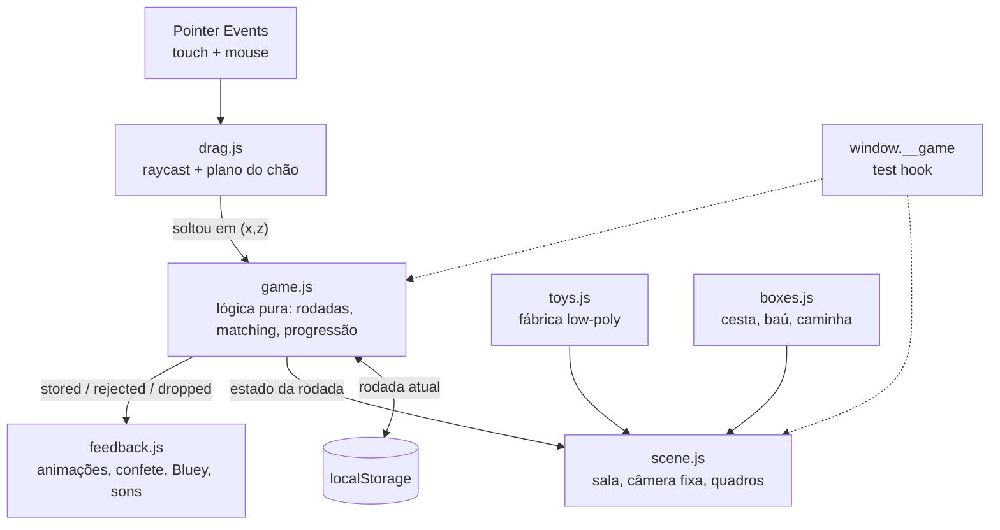

# "Hora de Guardar!" Design

**Spec**: `.specs/features/hora-de-guardar/spec.md`
**Status**: Draft (arquitetura aprovada pelo usuário no brainstorming; formalização aguardando OK)

---

## Architecture Overview

Página estática Vite + Three.js (JS puro, AD-001). Um único diorama com câmera fixa (AD-002).
A lógica de jogo é pura e isolada do renderer (AD-004); os módulos de cena consomem eventos
da lógica e produzem visual/som.



**Pesquisa (Knowledge Chain / Context7):** confirmado na doc atual do Three.js que
`DragControls` arrasta em profundidade livre — reforça AD-003 (arrasto próprio via
`Raycaster.setFromCamera` contra um plano invisível na altura do chão). Picking por
raycast e Pointer Events cobrem touch+mouse com um só código.

---

## Code Reuse Analysis

Projeto greenfield — não há código existente. Reuso se dá por biblioteca e padrão:

| Componente | Origem | Como usar |
|---|---|---|
| `THREE.Raycaster`, `PerspectiveCamera`, primitivas | three (npm) | Base de cena, picking e modelos low-poly |
| Padrão de picking/drag por plano | Exemplos oficiais Three.js (via Context7) | Adaptar para Pointer Events + clamp no chão |
| Sons livres | kenney.nl / freesound | Arquivos em `assets/sounds/` |
| Key art / personagens | Media hub oficial (docs/references.md) | `assets/bluey/` — uso privado (AD-005) |

### Integration Points

| Sistema | Método |
|---|---|
| `localStorage` | Chave única `hora-de-guardar:round` (número); acesso via wrapper tolerante a exceção |
| Playwright MCP (E2E) | Hook `window.__game` exposto pelo jogo para E2E guiado por prompt (ver Testing) |

---

## Components

### game.js — lógica pura (sem Three.js, sem DOM)

- **Purpose**: Estado e regras: geração de rodada, matching por tipo, progressão, persistência.
- **Location**: `src/game.js`
- **Interfaces**:
  - `createGame(storage): Game` — `storage` injetável (localStorage ou stub nos testes)
  - `game.startRound(): RoundState` — gera brinquedos da rodada (6/9/12, tipos equilibrados, cores/posições via RNG semeável)
  - `game.tryStore(toyId, boxType): 'stored' | 'rejected'` — regra de matching
  - `game.isRoundComplete(): boolean`
  - `game.advanceRound(): number` — incrementa e persiste
  - `game.currentRound: number`
- **Dependencies**: nenhuma
- **Reuses**: —

### scene.js — palco

- **Purpose**: Renderer, câmera fixa, luzes, sala (chão+parede), quadros com key art, resize.
- **Location**: `src/scene.js`
- **Interfaces**: `createScene(canvas): { scene, camera, renderer, floorY, onResize() }`
- **Dependencies**: three
- **Reuses**: padrão de resize responsivo dos exemplos oficiais

### toys.js — fábrica de brinquedos

- **Purpose**: Malhas low-poly por tipo (`ball`, `block`, `plush`) com variação de cor; sem assets externos.
- **Location**: `src/toys.js`
- **Interfaces**: `createToyMesh(type, color): THREE.Group` (com `userData.toyId/type`)
- **Dependencies**: three

### boxes.js — caixas

- **Purpose**: Cesta (bolas), baú (blocos), caminha (bichinhos), com placas de personagem e raio de acerto generoso.
- **Location**: `src/boxes.js`
- **Interfaces**: `createBoxes(): Box[]` — `Box = { mesh, type, snapRadius, position }`
- **Dependencies**: three; texturas de `assets/bluey/` com fallback de cor sólida

### drag.js — entrada

- **Purpose**: Pointer Events unificados; raycast pega brinquedo; arrasto preso ao plano do chão com clamp; 1 ponteiro por vez.
- **Location**: `src/drag.js`
- **Interfaces**: `createDrag({ camera, canvas, toys, floorY, onDrop(toyId, positionXZ) })`
- **Dependencies**: three (Raycaster, Plane)

### feedback.js — resposta sensorial

- **Purpose**: Tweens (sugar para caixa, quicar de volta, balançar caixa), confete de partículas, aparição da Bluey, sons.
- **Location**: `src/feedback.js`
- **Interfaces**: `feedback.stored(toy, box)`, `feedback.rejected(toy, box)`, `feedback.roundComplete()`, `feedback.unlockAudio()`
- **Dependencies**: three, WebAudio; assets de som/imagem com fallback

### main.js — composição

- **Purpose**: Liga tudo: cria cena/jogo/drag/feedback, loop de render, tela inicial (botão play → destrava áudio), expõe `window.__game` (hook de teste).
- **Location**: `src/main.js`

---

## Data Models

```js
// ToyType: 'ball' | 'block' | 'plush'
// RoundState
{
  round: 1,
  toys: [ { id: 't1', type: 'ball', color: '#e84', spawn: { x, z }, state: 'idle' } ],
  // toy.state: 'idle' | 'dragging' | 'stored'
  phase: 'playing' // 'playing' | 'celebrating'
}
// Persistência: localStorage['hora-de-guardar:round'] = '2'
```

**Test hook (`window.__game`)** — somente leitura + determinismo, para E2E guiado por prompt:

```js
window.__game = {
  state(),                 // RoundState atual (cópia)
  screenPos(objectId),     // posição {x,y} em pixels de brinquedo/caixa (projeção da câmera)
  seed(n),                 // torna a próxima rodada determinística
}
```

---

## Error Handling Strategy

| Cenário | Tratamento | Impacto para a criança |
|---|---|---|
| Imagem oficial falha ao carregar | `TextureLoader` com `onError` → material de cor sólida; `console.warn` | Painel colorido no lugar do quadro; jogo normal |
| Áudio não destrava | try/catch no `AudioContext.resume()`; flag `muted` | Jogo em silêncio |
| `localStorage` lança exceção | wrapper try/catch → rodada 1, sem persistir | Recomeça da 1 ao reabrir |
| Ponteiro sai da janela arrastando | `pointercancel`/`pointerleave` → solta como "fora de caixa" | Brinquedo assenta no chão |
| WebGL indisponível | detecção na carga → mensagem estática simples | Adulto entende; criança não chega a ver tela quebrada |

---

## Testing Strategy

Dois níveis (AD-004 + AD-006):

1. **Unit (Vitest)** — `src/game.js` 1:1 com ACs de GUARD-02/03/04/05/06 (matching, geração de rodada, progressão, persistência com storage stub, máquina de estados).
2. **E2E guiado por prompt via Playwright MCP** — cenários descritos em Markdown em `e2e/scenarios/*.md`, executados pelo agente com as tools do Playwright MCP (navegar, snapshot, disparar Pointer Events via `browser_evaluate` usando `window.__game.screenPos()` para coordenadas, screenshots como evidência). Cobrem GUARD-01/02/03/05/07/08/09 ponta-a-ponta no navegador real, incluindo simulação de touch. Rodam como gate Full das fases de integração e na verificação final (Verifier).

O hook `window.__game` existe para tornar os cenários determinísticos (seed) e localizáveis
(coordenadas de tela dos objetos 3D — o canvas é opaco para snapshot de acessibilidade).

---

## Risks & Concerns

| Concern | Localização | Impacto | Mitigação |
|---|---|---|---|
| IP da Bluey (assets oficiais) | `assets/bluey/` | Risco jurídico se publicado | AD-005: uso privado; fallbacks fazem o jogo funcionar sem os assets |
| Canvas WebGL é invisível para asserts de DOM | E2E | E2E frágil se depender de pixels | Hook `window.__game` + asserts sobre estado; screenshot só como evidência visual |
| Performance em tablet modesto | cena/partículas | Travadas estragam a experiência | Low-poly, sem sombras dinâmicas caras, confete com pool limitado de partículas; validar cedo no tablet real |
| Texturas grandes de key art | `assets/bluey/` | Carga lenta em rede local | Redimensionar assets para ≤1024px no tratamento |

---

## Tech Decisions (only non-obvious ones)

| Decision | Choice | Rationale |
|---|---|---|
| E2E | Prompt-guided via Playwright MCP (cenários .md), não specs `@playwright/test` | Pedido do usuário; agente executa e julga com contexto; sem manter suite de código E2E |
| Determinismo p/ testes | RNG semeável em `game.js` + `seed()` no hook | E2E e unit reproduzíveis |
| Animações | Tween próprio minimalista (lerp + easing) em `feedback.js` | Evita dependência (GSAP etc.) para meia dúzia de animações |
| Áudio | WebAudio API direto (sem Howler) | Poucos sons, controle de unlock explícito |

> Registrado em `.specs/STATE.md`: AD-006 (E2E guiado por prompt via Playwright MCP).
