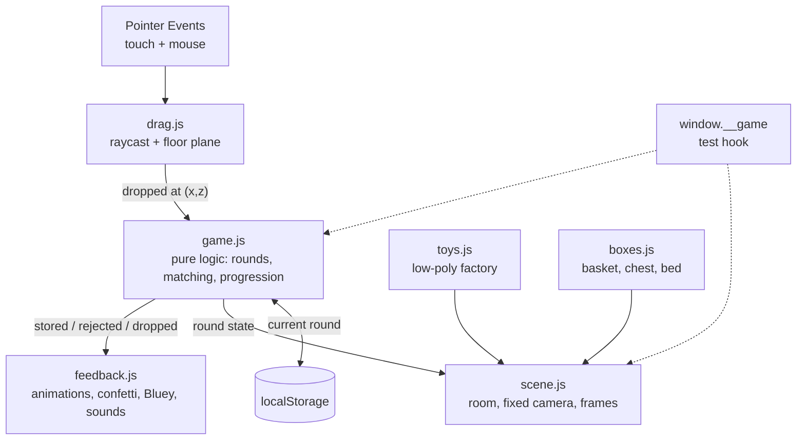

# "Hora de Guardar!" Design

**Spec**: `.specs/features/hora-de-guardar/spec.md`
**Status**: Draft (architecture approved by the user during brainstorming; formalization awaiting OK)

---

## Architecture Overview

Static Vite + Three.js page (plain JS, AD-001). A single diorama with a fixed camera (AD-002).
The game logic is pure and isolated from the renderer (AD-004); the scene modules consume
events from the logic and produce visuals/sound.



**Research (Knowledge Chain / Context7):** confirmed in the current Three.js docs that
`DragControls` drags with free depth — this reinforces AD-003 (custom dragging via
`Raycaster.setFromCamera` against an invisible plane at floor height). Raycast picking
and Pointer Events cover touch+mouse with a single codebase.

---

## Code Reuse Analysis

Greenfield project — there is no existing code. Reuse comes from libraries and patterns:

| Component | Source | How it's used |
|---|---|---|
| `THREE.Raycaster`, `PerspectiveCamera`, primitives | three (npm) | Scene base, picking and low-poly models |
| Plane-based picking/drag pattern | Official Three.js examples (via Context7) | Adapted for Pointer Events + floor clamp |
| Free sounds | kenney.nl / freesound | Files in `assets/sounds/` |
| Key art / characters | Official media hub (docs/references.md) | `assets/bluey/` — private use only (AD-005) |

### Integration Points

| System | Method |
|---|---|
| `localStorage` | Single key `hora-de-guardar:round` (number); accessed via an exception-tolerant wrapper |
| Playwright MCP (E2E) | `window.__game` hook exposed by the game for prompt-guided E2E (see Testing) |

---

## Components

### game.js — pure logic (no Three.js, no DOM)

- **Purpose**: State and rules: round generation, matching by type, progression, persistence.
- **Location**: `src/game.js`
- **Interfaces**:
  - `createGame(storage): Game` — `storage` injectable (localStorage or a stub in tests)
  - `game.startRound(): RoundState` — generates the round's toys (6/9/12, balanced types, seedable-RNG colors/positions)
  - `game.tryStore(toyId, boxType): 'stored' | 'rejected'` — matching rule
  - `game.isRoundComplete(): boolean`
  - `game.advanceRound(): number` — increments and persists
  - `game.currentRound: number`
- **Dependencies**: none
- **Reuses**: —

### scene.js — the stage

- **Purpose**: Renderer, fixed camera, lights, room (floor+wall), frames with key art, resize.
- **Location**: `src/scene.js`
- **Interfaces**: `createScene(canvas): { scene, camera, renderer, floorY, onResize() }`
- **Dependencies**: three
- **Reuses**: responsive resize pattern from the official examples

### toys.js — toy factory

- **Purpose**: Low-poly meshes per type (`ball`, `block`, `plush`) with color variation; no external assets.
- **Location**: `src/toys.js`
- **Interfaces**: `createToyMesh(type, color): THREE.Group` (with `userData.toyId/type`)
- **Dependencies**: three

### boxes.js — boxes

- **Purpose**: Basket (balls), chest (blocks), bed (plush toys), with character plaques and a generous hit radius.
- **Location**: `src/boxes.js`
- **Interfaces**: `createBoxes(): Box[]` — `Box = { mesh, type, snapRadius, position }`
- **Dependencies**: three; textures from `assets/bluey/` with solid-color fallback

### drag.js — input

- **Purpose**: Unified Pointer Events; raycast picks up the toy; drag constrained to the floor plane with clamping; 1 pointer at a time.
- **Location**: `src/drag.js`
- **Interfaces**: `createDrag({ camera, canvas, toys, floorY, onDrop(toyId, positionXZ) })`
- **Dependencies**: three (Raycaster, Plane)

### feedback.js — sensory response

- **Purpose**: Tweens (fly to box, bounce back, shake box), particle confetti, Bluey's appearance, sounds.
- **Location**: `src/feedback.js`
- **Interfaces**: `feedback.stored(toy, box)`, `feedback.rejected(toy, box)`, `feedback.roundComplete()`, `feedback.unlockAudio()`
- **Dependencies**: three, WebAudio; sound/image assets with fallback

### main.js — composition

- **Purpose**: Wires everything together: creates scene/game/drag/feedback, render loop, start screen (play button → unlocks audio), exposes `window.__game` (test hook).
- **Location**: `src/main.js`

---

## Data Models

```js
// ToyType: 'ball' | 'block' | 'plush'
// RoundState
{
  round: 1,
  toys: [ { id: 't1', type: 'ball', color: '#e84', spawn: { x, z }, state: 'idle' } ],
  // toy.state: 'idle' | 'dragging' | 'stored'
  phase: 'playing' // 'playing' | 'celebrating'
}
// Persistence: localStorage['hora-de-guardar:round'] = '2'
```

**Test hook (`window.__game`)** — read-only + determinism, for prompt-guided E2E:

```js
window.__game = {
  state(),                 // current RoundState (copy)
  screenPos(objectId),     // pixel {x,y} position of a toy/box (camera projection)
  seed(n),                 // makes the next round deterministic
}
```

---

## Error Handling Strategy

| Scenario | Handling | Impact on the child |
|---|---|---|
| Official image fails to load | `TextureLoader` with `onError` → solid-color material; `console.warn` | Colored panel instead of the frame; normal game |
| Audio doesn't unlock | try/catch around `AudioContext.resume()`; `muted` flag | Game in silence |
| `localStorage` throws an exception | try/catch wrapper → round 1, no persistence | Restarts at 1 on reopen |
| Pointer leaves the window while dragging | `pointercancel`/`pointerleave` → released as "outside a box" | Toy settles on the floor |
| WebGL unavailable | detected on load → simple static message | Adult understands; child never sees a broken screen |

---

## Testing Strategy

Two levels (AD-004 + AD-006):

1. **Unit (Vitest)** — `src/game.js` 1:1 with the ACs of GUARD-02/03/04/05/06 (matching, round generation, progression, persistence with a storage stub, state machine).
2. **Prompt-guided E2E via Playwright MCP** — scenarios described in Markdown in `e2e/scenarios/*.md`, executed by the agent using the Playwright MCP tools (navigate, snapshot, trigger Pointer Events via `browser_evaluate` using `window.__game.screenPos()` for coordinates, screenshots as evidence). Cover GUARD-01/02/03/05/07/08/09 end-to-end in a real browser, including touch simulation. Run as the Full gate for integration phases and in the final verification (Verifier).

The `window.__game` hook exists to make the scenarios deterministic (seed) and locatable
(screen coordinates of the 3D objects — the canvas is opaque to accessibility snapshots).

---

## Risks & Concerns

| Concern | Location | Impact | Mitigation |
|---|---|---|---|
| Bluey IP (official assets) | `assets/bluey/` | Legal risk if published | AD-005: private use; fallbacks make the game work without the assets |
| WebGL canvas is invisible to DOM asserts | E2E | Fragile E2E if it depends on pixels | `window.__game` hook + state asserts; screenshot only as visual evidence |
| Performance on a modest tablet | scene/particles | Stutter ruins the experience | Low-poly, no expensive dynamic shadows, confetti with a limited particle pool; validate early on a real tablet |
| Large key-art textures | `assets/bluey/` | Slow load on a local network | Resize assets to ≤1024px during processing |

---

## Tech Decisions (only non-obvious ones)

| Decision | Choice | Rationale |
|---|---|---|
| E2E | Prompt-guided via Playwright MCP (.md scenarios), not `@playwright/test` specs | User's request; the agent runs and judges with context; no E2E code suite to maintain |
| Determinism for tests | Seedable RNG in `game.js` + `seed()` on the hook | Reproducible E2E and unit tests |
| Animations | Minimal custom tween (lerp + easing) in `feedback.js` | Avoids a dependency (GSAP etc.) for half a dozen animations |
| Audio | WebAudio API directly (no Howler) | Few sounds, explicit unlock control |

> Recorded in `.specs/STATE.md`: AD-006 (prompt-guided E2E via Playwright MCP).
