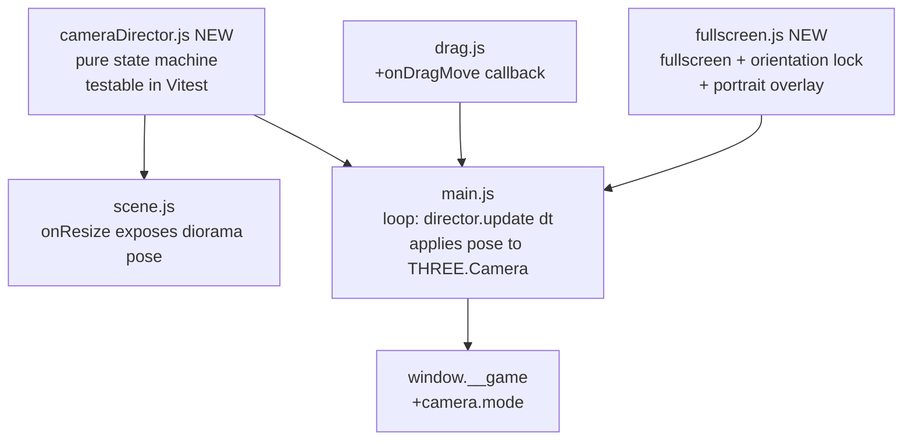

# Mobile Camera & Fullscreen Design

**Spec**: `.specs/features/mobile-camera/spec.md`
**Status**: Approved (architecture A: pure cameraDirector, confirmed with the user)

---

## Architecture Overview



`cameraDirector.js` follows the same pattern as `game.js` (AD-004): pure logic, no `THREE.*`, tested by Vitest with flat objects `{x, y, z}`. `main.js` reads the computed pose and applies it to `camera.position`/`camera.lookAt` every frame — no other module manipulates the camera directly.

---

## Code Reuse Analysis

### Existing Components to Leverage

| Component | Location | How to Use |
| --------- | -------- | ---------- |
| Testable pure-logic pattern (AD-004) | `src/game.js` | Structural model for `cameraDirector.js`: no `three`, no DOM, testable in isolation |
| `onResize()` (diorama pose calculation) | `src/scene.js:100-110` | Refactored into a pure function `dioramaPose(aspect)` consumed by both `onResize` and `cameraDirector` (`idle` state) — eliminates formula duplication |
| `FLOOR_BOUNDS`, box positions (`BOX_Z`) | `src/game.js:6`, `src/boxes.js:80` | Used to calculate the "bounding" the camera needs to frame in `follow`/`emphasis` (see Tech Decisions — framing algorithm) |
| `window.__game` hook | `src/main.js:180` | Extended with `camera: { mode }` |
| Existing `dt` clamp in the loop | `src/main.js:205` | Reused as-is — protects `cameraDirector.update(dt)` from jumps when the tab wakes up (edge case from the spec) |

### Integration Points

| System | Integration Method |
| ------ | -------------------- |
| Vitest | New `cameraDirector.test.js`, same pattern as `game.test.js` |
| E2E | Scenario 05 (viewport/portrait) needs to be rewritten — portrait behavior changes from "pull camera back" to "overlay + pause" (see Risks & Concerns) |
| `drag.js` | Extended with `onDragMove` (new callback, additive) to feed `cameraDirector.follow(pos)` on every `pointermove` |

---

## Components

### `cameraDirector.js` (new — pure logic, no `three`)

- **Purpose**: Camera state machine + smooth interpolation (critically-damped spring/lerp) — decides the POSE (eye position + look-at point), never touches `THREE.Camera` directly.
- **Location**: `src/cameraDirector.js`
- **Interfaces**:
  - `createCameraDirector({ dioramaPose, roomBounds }): CameraDirector`
  - `CameraDirector.follow(worldPos: {x,z})` — enters/updates `follow` mode, called on every `pointermove` during a drag
  - `CameraDirector.emphasize(worldPos: {x,z})` — `emphasis` mode (brief push-in on the box)
  - `CameraDirector.celebrate(centerPos: {x,z}, duration: number)` — `celebrate` mode (fly-around)
  - `CameraDirector.release()` — exits the current mode → `return` → `idle`
  - `CameraDirector.update(dt: number): { position: {x,y,z}, lookAt: {x,y,z}, mode: CameraMode }` — advances the simulation and returns the frame's pose
  - `CameraDirector.mode: CameraMode` — getter, mirrored in the hook
- **Dependencies**: none (pure function + internal state)
- **Reuses**: None — it is the newest module of the feature pair; follows the AD-004 pattern

**State machine** (AC MOB-04..07):

```
idle ──follow()──▶ follow ──release()──▶ return ──(reaches target)──▶ idle
follow ──emphasize()──▶ emphasis ──(≤1s OR new follow())──▶ follow | return
idle/return ──celebrate()──▶ celebrate ──(duration)──▶ return ──▶ idle
```

Non-overlap rules (equivalent to AC VIS-07.5 for transitions, here for the camera): a new `follow()` during `emphasis` cancels the emphasis and immediately takes over the follow (AC MOB-05.3); `celebrate()` is only accepted from `idle`/`return` — it never interrupts an ongoing `follow` (edge case: celebration waits for the drop, see spec).

### `main.js` (modified — orchestration)

- **Change 1**: creates `cameraDirector` after `createScene`; the animation loop now does:
  ```javascript
  const pose = cameraDirector.update(dt);
  camera.position.set(pose.position.x, pose.position.y, pose.position.z);
  camera.lookAt(pose.lookAt.x, pose.lookAt.y, pose.lookAt.z);
  ```
  before `renderer.render(scene, camera)` — ensures the next `pointermove` raycast (which runs between frames) always uses the most recent matrix (`WebGLRenderer.render()` already updates `camera.matrixWorld` on every call, reusing Three.js's native behavior).
- **Change 2**: the existing `onPick` now calls `cameraDirector.follow(toy.spawn)`; `createDrag` receives a new `onDragMove: (toyId, pos) => cameraDirector.follow(pos)`; `handleDrop` calls `cameraDirector.emphasize(box.position)` on the `'stored'` path and `cameraDirector.release()` on the others.
- **Change 3**: `roundComplete` (inside `handleDrop`) calls `cameraDirector.celebrate({x:0,z:ROOM.wallZ+ROOM.depth/2}, 3)` (same duration as the existing confetti shower).
- **Reuses**: Existing composition structure — no rewrite, just additional call sites in already-present handlers.

### `drag.js` (modified)

- **Change**: new optional callback `onDragMove(toyId, {x, z})`, fired at the end of `onPointerMove` (after moving the toy) — additive, defaults to `undefined` (no-op if omitted).
- **Reuses**: 100% of the existing raycast/plane logic (AD-003) — the camera can move freely because the raycast already reads `camera` by reference on every event.

### `fullscreen.js` (new)

- **Purpose**: Fullscreen request + orientation lock (best effort) on the play gesture; portrait overlay outside the initial screen.
- **Location**: `src/fullscreen.js`
- **Interfaces**:
  - `requestGameFullscreen(canvas: HTMLElement): Promise<void>` — tries `canvas.requestFullscreen()` + `screen.orientation.lock('landscape')`; never rejects unhandled (AC MOB-01/02: failure is always silent)
  - `createPortraitGuard({ overlayEl, onBlock, onUnblock }): PortraitGuard` — listens to `resize`/`orientationchange`, toggles the overlay's class and calls `onBlock()`/`onUnblock()` (used to pause/resume the input gate)
  - `PortraitGuard.isPortrait(): boolean`
- **Dependencies**: `Fullscreen API`, `Screen Orientation API` (both checked with feature-detection before use — no assumption of support)
- **Reuses**: The feature-detection pattern already used in `main.js:15-23` (`webglAvailable()`) — same "try, degrade silently" philosophy

---

## Data Models

### `CameraMode` (not persisted — in-memory state of `cameraDirector.js`)

```typescript
type CameraMode = 'idle' | 'follow' | 'emphasis' | 'celebrate' | 'return';
```

Mirrored in `window.__game.state().camera.mode`.

### `CameraPose` (return value of `update(dt)`, not persisted)

```typescript
interface CameraPose {
  position: { x: number; y: number; z: number };
  lookAt: { x: number; y: number; z: number };
  mode: CameraMode;
}
```

---

## Error Handling Strategy

| Error Scenario | Handling | User Impact |
| --------------- | -------- | ------------ |
| `Fullscreen API` absent (`canvas.requestFullscreen` undefined) | Feature-detected before calling; no unnecessary `try/catch` — simply not called | Game runs in normal viewport (CSS already covers 100%) |
| `requestFullscreen()` rejects (browser block, iOS Safari) | `.catch(() => {})` — silent | Same as above |
| `screen.orientation.lock()` absent or rejects | Feature-detected + `.catch(() => {})` | Portrait overlay covers the case when the user rotates anyway |
| Portrait during an active drag | `PortraitGuard.onBlock()` fires the equivalent `endDrag` (same path as "released outside", reuse of `settle`) | Toy settles in place, no state loss |

---

## Risks & Concerns

| Concern | Location | Impact | Mitigation |
| ------- | -------- | ------ | ---------- |
| `onResize()` currently sets `camera.position`/`lookAt` directly — conflicts with `cameraDirector` if both write to the camera | `src/scene.js:100-110` | Camera "fights" between resize and director, unstable pose | `onResize` stops touching the camera; it now only recalculates `renderer.setSize`/`camera.aspect`/`updateProjectionMatrix` and returns the new `dioramaPose(aspect)`, which `main.js` forwards to `cameraDirector.setIdlePose(pose)` |
| E2E scenario 05 assumes "portrait pulls the camera back" (current behavior) | `e2e/scenarios/05-*.md` | Scenario breaks with the change to overlay+pause | Execute task: rewrite scenario 05 for the new contract (documented in `context.md`: "supersedes part of e2e scenario 05") |
| `screenPos()`/`boxScreenRadius()` in `main.js` project using the camera at the instant of the call — with the camera in continuous motion, e2e calls may capture a transient pose | `src/main.js:88-107` | Position asserts in e2e can become unstable (flaky) | E2E scenarios should check `camera.mode === 'idle'` before asserting `screenPos` of static UI; document this rule in the rewritten scenarios |
| Framing algorithm (keeping 3 boxes + toy visible during `follow`) is new math, with no precedent in the code | `src/cameraDirector.js` (new) | Risk of the camera cutting off a box outside the field of view on very narrow screens | See Tech Decisions — "minimum distance per bounding box" formula based on FOV/aspect, with a unit test guaranteeing that the 4 points (3 boxes + target) project within [-1,1] NDC across a matrix of test aspects (extreme portrait to wide landscape) |
| Shadow map + continuously moving camera (feature `visual-bluey`) add up GPU cost | `src/scene.js` | Frame drop on a modest phone | P2 "Mobile quality" of this spec covers manual validation of smoothness; if needed, reducing `shadow.mapSize` or the shadow update frequency (`light.shadow.autoUpdate`) is a fine-tuning left to Execute |

---

## Tech Decisions

| Decision | Choice | Rationale |
| -------- | ------ | --------- |
| Camera controlled by a pure module | `cameraDirector.js` with no dependency on `three` | Follows AD-004; lets Vitest cover the state machine and framing math without headless WebGL |
| Smoothing | Exponential damping (`pos += (target - pos) * (1 - Math.exp(-k * dt))`) instead of a fixed-duration tween | Responds well to targets that change every frame (`follow` during `pointermove`) — a fixed-duration tween would restart on every finger movement, causing jitter |
| Framing algorithm in `follow`/`emphasis` | Minimum camera distance = the largest distance needed, across the points of interest (the current target + the 3 boxes), to fit within the frustum given the current `fov`/`aspect` — same principle as the `widen` already used in `onResize`, generalized to a set of points | Reuses the existing rationale (`scene.js:106`) instead of inventing a new heuristic; guarantees the spec invariant (AC MOB-04.1) by construction, not by manually tuning constants |
| Fullscreen + orientation lock | Best effort with feature-detection, no polyfill | iOS Safari doesn't support `requestFullscreen` on `<canvas>` outside specific contexts — documented and accepted behavior in the spec (Assumptions) |
| Serving on the LAN | `vite --host` / `vite preview --host`, documented in the README | Already natively supported by Vite; not application code, just configuration/documentation |

---

## Tips

Scope: **Large** (new state machine, new framing math, integration with two features). Tasks split into phases: (1) `cameraDirector.js` + pure tests, (2) integration in `main.js`/`drag.js`, (3) `fullscreen.js` + portrait overlay, (4) review of affected e2e scenarios.
