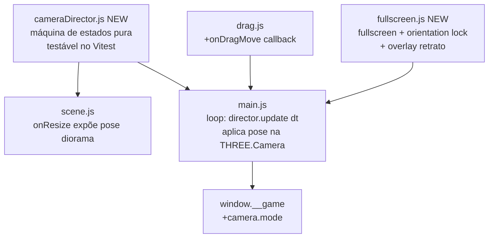

# Mobile Camera & Fullscreen Design

**Spec**: `.specs/features/mobile-camera/spec.md`
**Status**: Approved (arquitetura A: cameraDirector puro, confirmada com o usuário)

---

## Architecture Overview



`cameraDirector.js` segue o mesmo padrão de `game.js` (AD-004): lógica pura, sem `THREE.*`, testada por Vitest com objetos planos `{x, y, z}`. `main.js` lê a pose calculada e aplica em `camera.position`/`camera.lookAt` a cada frame — nenhum outro módulo manipula a câmera diretamente.

---

## Code Reuse Analysis

### Existing Components to Leverage

| Component | Location | How to Use |
| --------- | -------- | ---------- |
| Padrão de lógica pura testável (AD-004) | `src/game.js` | Modelo estrutural para `cameraDirector.js`: sem `three`, sem DOM, testável isoladamente |
| `onResize()` (cálculo de pose diorama) | `src/scene.js:100-110` | Refatorado para uma função pura `dioramaPose(aspect)` que tanto `onResize` quanto `cameraDirector` (estado `idle`) consomem — elimina duplicação de fórmula |
| `FLOOR_BOUNDS`, posições das caixas (`BOX_Z`) | `src/game.js:6`, `src/boxes.js:80` | Usados para calcular o "bounding" que a câmera precisa enquadrar em `follow`/`emphasis` (ver Tech Decisions — algoritmo de enquadramento) |
| `window.__game` hook | `src/main.js:180` | Estendido com `camera: { mode }` |
| Clamp de `dt` já existente no loop | `src/main.js:205` | Reusado tal qual — protege `cameraDirector.update(dt)` de saltos ao acordar a aba (edge case da spec) |

### Integration Points

| System | Integration Method |
| ------ | -------------------- |
| Vitest | `cameraDirector.test.js` novo, mesmo padrão de `game.test.js` |
| E2E | Cenário 05 (viewport/retrato) precisa reescrita — comportamento de retrato muda de "afasta câmera" para "overlay + pausa" (ver Risks & Concerns) |
| `drag.js` | Estende com `onDragMove` (novo callback, aditivo) para alimentar `cameraDirector.follow(pos)` a cada `pointermove` |

---

## Components

### `cameraDirector.js` (novo — lógica pura, sem `three`)

- **Purpose**: Máquina de estados da câmera + interpolação suave (spring/lerp crítico) — decide POSE (posição do olho + ponto de mira), nunca toca `THREE.Camera` diretamente.
- **Location**: `src/cameraDirector.js`
- **Interfaces**:
  - `createCameraDirector({ dioramaPose, roomBounds }): CameraDirector`
  - `CameraDirector.follow(worldPos: {x,z})` — entra/atualiza o modo `follow`, chamado a cada `pointermove` do arrasto
  - `CameraDirector.emphasize(worldPos: {x,z})` — modo `emphasis` (push-in breve na caixa)
  - `CameraDirector.celebrate(centerPos: {x,z}, duration: number)` — modo `celebrate` (passeio)
  - `CameraDirector.release()` — sai do modo atual → `return` → `idle`
  - `CameraDirector.update(dt: number): { position: {x,y,z}, lookAt: {x,y,z}, mode: CameraMode }` — avança a simulação e retorna a pose do frame
  - `CameraDirector.mode: CameraMode` — getter, espelhado no hook
- **Dependencies**: nenhuma (função pura + estado interno)
- **Reuses**: Nenhum — é o módulo mais novo do par de features; segue o padrão AD-004

**Máquina de estados** (AC MOB-04..07):

```
idle ──follow()──▶ follow ──release()──▶ return ──(chega ao alvo)──▶ idle
follow ──emphasize()──▶ emphasis ──(≤1s OU novo follow())──▶ follow | return
idle/return ──celebrate()──▶ celebrate ──(duration)──▶ return ──▶ idle
```

Regras de não sobreposição (equivalente ao AC VIS-07.5 de transições, aqui para câmera): um novo `follow()` durante `emphasis` cancela a ênfase e assume o follow imediatamente (AC MOB-05.3); `celebrate()` só é aceito a partir de `idle`/`return` — nunca interrompe um `follow` em andamento (edge case: celebração aguarda o drop, ver spec).

### `main.js` (modificado — orquestração)

- **Mudança 1**: cria `cameraDirector` após `createScene`; loop de animação passa a fazer:
  ```javascript
  const pose = cameraDirector.update(dt);
  camera.position.set(pose.position.x, pose.position.y, pose.position.z);
  camera.lookAt(pose.lookAt.x, pose.lookAt.y, pose.lookAt.z);
  ```
  antes de `renderer.render(scene, camera)` — garante que o raycast do próximo `pointermove` (que roda entre frames) sempre usa a matriz mais recente (a `WebGLRenderer.render()` já atualiza `camera.matrixWorld` a cada chamada, reuso do comportamento nativo do Three.js).
- **Mudança 2**: `onPick` (já existente) passa a chamar `cameraDirector.follow(toy.spawn)`; `createDrag` recebe novo `onDragMove: (toyId, pos) => cameraDirector.follow(pos)`; `handleDrop` chama `cameraDirector.emphasize(box.position)` no caminho `'stored'` e `cameraDirector.release()` nos demais.
- **Mudança 3**: `roundComplete` (dentro de `handleDrop`) chama `cameraDirector.celebrate({x:0,z:ROOM.wallZ+ROOM.depth/2}, 3)` (mesma duração da chuva de confete existente).
- **Reuses**: Estrutura de composição existente — nenhuma reescrita, apenas pontos de chamada adicionais nos handlers já presentes.

### `drag.js` (modificado)

- **Mudança**: novo callback opcional `onDragMove(toyId, {x, z})`, disparado ao fim de `onPointerMove` (depois de mover o brinquedo) — aditivo, default `undefined` (no-op se omitido).
- **Reuses**: 100% da lógica de raycast/plano existente (AD-003) — câmera pode se mover livremente porque o raycast já lê `camera` por referência a cada evento.

### `fullscreen.js` (novo)

- **Purpose**: Pedido de fullscreen + orientation lock (best effort) no gesto de play; overlay de retrato fora da tela inicial.
- **Location**: `src/fullscreen.js`
- **Interfaces**:
  - `requestGameFullscreen(canvas: HTMLElement): Promise<void>` — tenta `canvas.requestFullscreen()` + `screen.orientation.lock('landscape')`; nunca rejeita de forma não tratada (AC MOB-01/02: falha é sempre silenciosa)
  - `createPortraitGuard({ overlayEl, onBlock, onUnblock }): PortraitGuard` — escuta `resize`/`orientationchange`, alterna a classe do overlay e chama `onBlock()`/`onUnblock()` (usado para pausar/retomar o gate de input)
  - `PortraitGuard.isPortrait(): boolean`
- **Dependencies**: `Fullscreen API`, `Screen Orientation API` (ambas checadas com feature-detection antes do uso — nenhuma suposição de suporte)
- **Reuses**: Padrão de feature-detection já usado em `main.js:15-23` (`webglAvailable()`) — mesma filosofia de "tentar, degradar em silêncio"

---

## Data Models

### `CameraMode` (não persistido — estado em memória do `cameraDirector.js`)

```typescript
type CameraMode = 'idle' | 'follow' | 'emphasis' | 'celebrate' | 'return';
```

Espelhado em `window.__game.state().camera.mode`.

### `CameraPose` (retorno de `update(dt)`, não persistido)

```typescript
interface CameraPose {
  position: { x: number; y: number; z: number };
  lookAt: { x: number; y: number; z: number };
  mode: CameraMode;
}
```

---

## Error Handling Strategy

| Error Scenario | Handling | User Impact |
| --------------- | -------- | ------------ |
| `Fullscreen API` ausente (`canvas.requestFullscreen` undefined) | Feature-detected antes de chamar; sem `try/catch` desnecessário — apenas não chama | Jogo roda em viewport normal (CSS já cobre 100%) |
| `requestFullscreen()` rejeita (bloqueio do navegador, iOS Safari) | `.catch(() => {})` — silencioso | Igual acima |
| `screen.orientation.lock()` ausente ou rejeita | Feature-detected + `.catch(() => {})` | Overlay de retrato cobre o caso quando o usuário gira mesmo assim |
| Retrato durante um arrasto ativo | `PortraitGuard.onBlock()` dispara `endDrag` equivalente (mesmo caminho de "solto fora", reuso do `settle`) | Brinquedo assenta no lugar, sem perda de estado |

---

## Risks & Concerns

| Concern | Location | Impact | Mitigation |
| ------- | -------- | ------ | ---------- |
| `onResize()` hoje seta `camera.position`/`lookAt` diretamente — conflita com `cameraDirector` se ambos escreverem na câmera | `src/scene.js:100-110` | Câmera "briga" entre resize e director, pose instável | `onResize` deixa de tocar a câmera; passa a apenas recalcular `renderer.setSize`/`camera.aspect`/`updateProjectionMatrix` e retornar a nova `dioramaPose(aspect)`, que `main.js` repassa ao `cameraDirector.setIdlePose(pose)` |
| Cenário e2e 05 assume "retrato afasta a câmera" (comportamento atual) | `e2e/scenarios/05-*.md` | Cenário quebra com a mudança para overlay+pausa | Task de Execute: reescrever cenário 05 para o novo contrato (documentado em `context.md`: "supersede parte do cenário e2e 05") |
| `screenPos()`/`boxScreenRadius()` em `main.js` projetam usando a câmera no instante da chamada — com a câmera em movimento contínuo, chamadas do e2e podem capturar uma pose transitória | `src/main.js:88-107` | Asserts de posição em e2e podem ficar instáveis (flaky) | Cenários e2e devem checar `camera.mode === 'idle'` antes de assertar `screenPos` de UI estática; documentar essa regra nos cenários reescritos |
| Algoritmo de enquadramento (manter 3 caixas + brinquedo visíveis durante `follow`) é matemática nova, sem precedente no código | `src/cameraDirector.js` (novo) | Risco de a câmera cortar uma caixa fora do campo de visão em telas muito estreitas | Ver Tech Decisions — fórmula de "distância mínima por bounding box" baseada em FOV/aspect, com teste unitário garantindo que os 4 pontos (3 caixas + alvo) projetam dentro de [-1,1] NDC para uma matriz de aspects de teste (retrato extremo a paisagem larga) |
| Shadow map + câmera em movimento contínuo (feature `visual-bluey`) somam custo de GPU | `src/scene.js` | Frame drop em celular modesto | P2 "Qualidade mobile" desta spec cobre validação manual de fluidez; se necessário, reduzir `shadow.mapSize` ou frequência de atualização da sombra (`light.shadow.autoUpdate`) fica como ajuste fino de Execute |

---

## Tech Decisions

| Decision | Choice | Rationale |
| -------- | ------ | --------- |
| Câmera controlada por módulo puro | `cameraDirector.js` sem dependência de `three` | Segue AD-004; permite Vitest cobrir a máquina de estados e a matemática de enquadramento sem WebGL headless |
| Suavização | Damping exponencial (`pos += (target - pos) * (1 - Math.exp(-k * dt))`) em vez de tween com duração fixa | Responde bem a alvos que mudam a cada frame (`follow` durante `pointermove`) — um tween de duração fixa reiniciaria a cada movimento do dedo, causando jitter |
| Algoritmo de enquadramento em `follow`/`emphasis` | Distância mínima da câmera = a maior distância necessária, entre os pontos de interesse (alvo do momento + as 3 caixas), para caber no frustum dado `fov`/`aspect` atuais — mesmo princípio do `widen` já usado em `onResize`, generalizado para um conjunto de pontos | Reuso do racional existente (`scene.js:106`) em vez de inventar heurística nova; garante a invariante da spec (AC MOB-04.1) por construção, não por ajuste manual de constantes |
| Fullscreen + orientation lock | Best effort com feature-detection, sem polyfill | iOS Safari não suporta `requestFullscreen` em `<canvas>` fora de contextos específicos — comportamento documentado e aceito na spec (Assumptions) |
| Servir na LAN | `vite --host` / `vite preview --host`, documentado no README | Já suportado nativamente pelo Vite; não é código de aplicação, é configuração/documentação |

---

## Tips

Escopo **Large** (nova máquina de estados, nova matemática de enquadramento, integração com duas features). Tasks quebra em fases: (1) `cameraDirector.js` + testes puros, (2) integração em `main.js`/`drag.js`, (3) `fullscreen.js` + overlay retrato, (4) revisão dos cenários e2e afetados.
