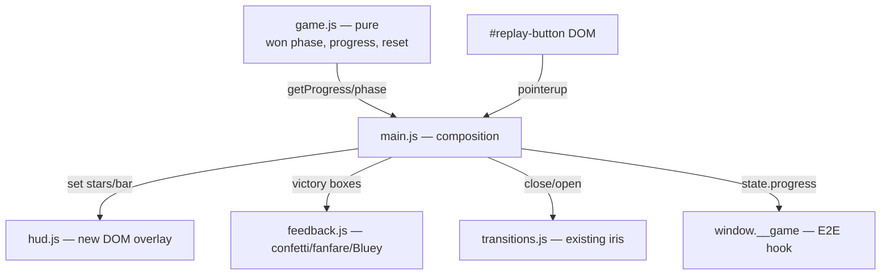

# Progress and Victory — Design

**Spec**: `.specs/features/progresso-e-vitoria/spec.md`
**Context**: `.specs/features/progresso-e-vitoria/context.md`
**Status**: Approved

---

## Architecture Overview

Follows the patterns already established in the project:

- **Pure logic in `game.js`** (AD-004): the `won` phase, the 3-round goal, progress, and
  reset become pure state/derivations, tested with Vitest.
- **HUD as a DOM overlay** (same rationale as the iris in `transitions.js`): plain CSS at
  the top of the screen, `pointer-events: none`, not competing with WebGL draw calls, and
  testable without jsdom (injected/mocked elements). Alternative (HUD in the 3D scene via
  sprites) discarded: it would follow the free camera (AD-007) and end up blurred/occludable —
  the HUD needs to be fixed and sharp.
- **Victory celebration in `feedback.js`**: reuses the confetti pool, the WebAudio
  fanfare, and Bluey's dance — just with bigger parameters + its own jingle.
- **Replay button**: same visual pattern as the existing `#play-button` (orange
  circle + white triangle, no text) — a language the child already knows.



---

## Code Reuse Analysis

### Existing Components to Leverage

| Component | Location | How to Use |
| --------- | -------- | ---------- |
| Round persistence (`readSavedRound`/`writeSavedRound`) | `src/game.js` | Extend: clamp for save > 3, key removal on victory |
| Confetti (`InstancedMesh` pool, `rain`) | `src/feedback.js` | `victory()` calls `rain(8)` — the fixed pool already caps the cost |
| WebAudio fanfare (`note`/`safePlay`) | `src/feedback.js` | Longer victory jingle using the same primitives |
| Bluey's dance (`danceAt`) | `src/bluey.js` | Longer center dance on victory |
| Iris (`transitions.close/open`) | `src/transitions.js` | Replay: close → reset/spawn → open (same flow as round transition) |
| `#play-button` style | `index.html` | Replicate for `#replay-button` (no text) |
| Test pattern with mocked elements | `src/transitions.test.js` | `hud.js` receives injected elements; tests mock `classList`/`style` |

### Integration Points

| System | Integration Method |
| ------ | ------------------- |
| `window.__game.state()` | Gains `progress: { round, totalRounds, stored, total, starsLit, phase }` for the E2E scenarios |
| WebGL error path (`main.js`) | Also removes `#hud` and `#replay-overlay` (WIN-01 AC 7) |
| `drag.js` | No change: `pickToy` already rejects when `phase !== 'playing'` (the `won` phase blocks it for free) |

---

## Components

### game.js (extended — pure)

- **Purpose**: owns the "3 rounds = victory" rule and the derived progress.
- **Location**: `src/game.js`
- **Interfaces** (new/changed):
  - `TOTAL_ROUNDS = 3` (export)
  - `tryStore(...)`: when storing the last toy, `phase = round >= TOTAL_ROUNDS ? 'won' : 'celebrating'`; when `won`, removes the storage key (WIN-05, WIN-07)
  - `advanceRound()`: no-op (returns the current round) when `phase === 'won'` — round 4 never exists (WIN-05)
  - `getProgress(): { round, totalRounds, stored, total, starsLit }` — `starsLit` = completed rounds (`round-1`, or `totalRounds` when `won`; bar = `stored/total` of the round) (WIN-02/03)
  - `reset()`: round 1, storage cleared, ready for `startRound()` (WIN-09)
  - `readSavedRound`: values `> TOTAL_ROUNDS` → 1 (old-save edge case)
- **Reuses**: mulberry32, tolerant storage wrappers (GUARD-06).

### hud.js (new — DOM, no three.js)

- **Purpose**: reflect progress in the bar and stars; no rule decisions.
- **Location**: `src/hud.js`
- **Interfaces**:
  - `createHud({ starEls, barFillEl })` — existing HTML elements, injected
  - `set({ starsLit, fraction })` — lights up `starEls[0..starsLit-1]` via `classList` `lit`; `barFillEl.style.width = fraction*100 + '%'`
  - Idempotent and clamped (fraction outside [0,1] is clamped; starsLit outside [0,3] likewise)
- **Dependencies**: none (injected elements → testable with mocks, following the `transitions.test.js` pattern).

### index.html (extended)

- `#hud` fixed at the top, centered: 3 `span.star` (star shape in inline CSS/SVG,
  no text) + `div.bar > div#bar-fill`. `pointer-events: none`; `z-index: 4`
  (below the iris at 5 — the iris covers the HUD during transitions, which is correct).
- `#replay-overlay` (hidden by default, class `hidden`): `#replay-button` visual
  clone of `#play-button`, `z-index: 10`.

### feedback.js (extended)

- **New interface**: `victory(boxes)` — `confetti.rain(8)`, `bluey.danceAt(center, 8)`,
  pulse on all the boxes, victory jingle (extended rising arpeggio, ~2s, same
  `note` primitives) (WIN-06). Distinct from `roundComplete` (3s/short fanfare).

### main.js (composition)

- Creates the HUD; updates `hud.set(...)` on: round spawn, each `stored`, replay.
- `handleDrop`, `stored` branch + round completed: if `getState().phase === 'won'` →
  `feedback.victory(boxes)`; `setTimeout(4000)` → shows `#replay-overlay` (WIN-08).
  Otherwise, current flow (celebration + iris + `advanceRound`).
- `#replay-button` `pointerup`: hides overlay → `transitions.close()` → `game.reset()`
  → `spawnRound()` → `hud.set` reset → `transitions.open()` (WIN-09).
- WebGL error path: also removes `#hud` and `#replay-overlay` along with the others.
- `window.__game.state()`: adds `progress`.

---

## Data Models

```js
// getProgress() — derived, never stored
{
  round: 1..3,        // current round
  totalRounds: 3,
  stored: 0..total,   // toys stored in the current round
  total: 6|9|12,      // toys in the current round
  starsLit: 0..3      // completed rounds (3 when phase === 'won')
}
```

Persistence: remains just the `hora-de-guardar:round` key (number). Victory
removes the key; save > 3 is treated as absent.

---

## Error Handling Strategy

| Error Scenario | Handling | User Impact |
| --------------- | -------- | ------------ |
| Storage unavailable/throws (private mode) | Existing try/catch wrappers; key removal is also try/catch | Game works in memory; victory/replay work normally |
| Old save with round > 3 | `readSavedRound` → 1 | Starts a new game, HUD reset |
| Audio blocked | Existing `safePlay` | Silent victory, everything else intact |
| WebGL unavailable | Removes `#hud`/`#replay-overlay` along with the other overlays | Only the error message appears |

---

## Risks & Concerns

| Concern | Location | Impact | Mitigation |
| ------- | -------- | ------ | ---------- |
| The 4s `setTimeout` of the round transition runs outside the game loop; on victory a second timer (replay button) could coexist with a quickly-triggered replay | `src/main.js:174` | An old timer could react after replay | The victory flow uses a single timer; replay hides the overlay, and the victory timer only *shows* the overlay — showing it after replay is impossible because the timer fires before the button exists on screen, and it's the timer itself that displays it. Cover with an E2E scenario |
| `advanceRound()` persists the round BEFORE the new round starts; if victory cleared storage elsewhere there would be a race | `src/game.js:126` | Ghost save after victory | Storage cleanup happens inside `tryStore` in the same tick where `phase = 'won'` — `advanceRound` never runs after that (no-op guard) |
| A wrong HUD z-index could cover the play button or sit above the error message | `index.html` | Broken UI on open/error | z-index 4 (< iris 5 < start 10 < error 20) + explicit removal on the error path; lesson from a previous SPEC_DEVIATION applied |

---

## Tech Decisions (only non-obvious ones)

| Decision | Choice | Rationale |
| -------- | ------ | --------- |
| HUD in DOM, not in the 3D scene | Fixed overlay `pointer-events:none` | The camera is free (AD-007): a 3D element would drift out of frame; DOM is sharp, cheap, and testable (same rationale as the iris) |
| Stars as pre-existing elements in the HTML | `hud.js` only toggles a class | Zero runtime DOM creation; module testable with mocks (transitions.test.js pattern) |
| `won` phase decided inside `tryStore` | game.js is the single source of the rule | main.js doesn't count rounds; mutants in main don't escape the pure gate |
| Bar per round (resets each round) | `stored/total` of the current round | Assumption confirmed in the discuss (per-toy micro-feedback; stars = macro) |

No new project-level decisions (all derive from active ADs).
