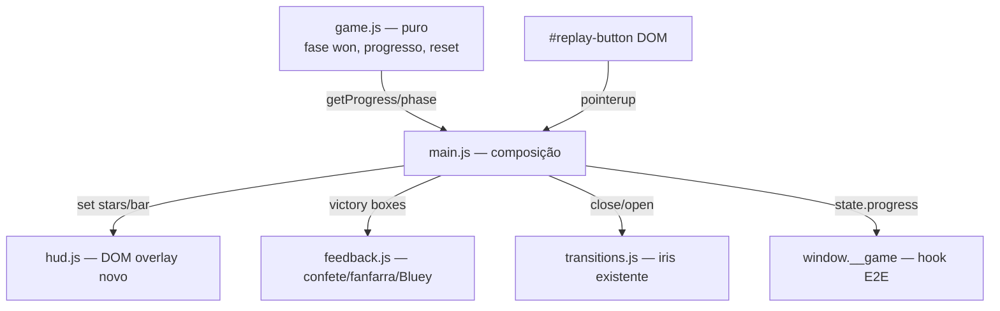

# Progresso e Vitória — Design

**Spec**: `.specs/features/progresso-e-vitoria/spec.md`
**Context**: `.specs/features/progresso-e-vitoria/context.md`
**Status**: Approved

---

## Architecture Overview

Segue os padrões já estabelecidos no projeto:

- **Lógica pura em `game.js`** (AD-004): fase `won`, meta de 3 rodadas, progresso e
  reset viram estado/derivações puras, testadas com Vitest.
- **HUD como overlay DOM** (mesmo racional do iris em `transitions.js`): CSS puro no
  topo da tela, `pointer-events: none`, sem disputar draw calls do WebGL e testável
  sem jsdom (elementos injetados/mockados). Alternativa (HUD em cena 3D via sprites)
  descartada: acompanharia a câmera livre (AD-007) e ficaria borrado/oclusível —
  o HUD precisa ser fixo e nítido.
- **Celebração de vitória em `feedback.js`**: reusa o pool de confete, a fanfarra
  WebAudio e a dança da Bluey — só com parâmetros maiores + jingle próprio.
- **Botão de replay**: mesmo padrão visual do `#play-button` existente (círculo
  laranja + triângulo branco, sem texto) — linguagem que a criança já conhece.



---

## Code Reuse Analysis

### Existing Components to Leverage

| Component | Location | How to Use |
| --------- | -------- | ---------- |
| Persistência de rodada (`readSavedRound`/`writeSavedRound`) | `src/game.js` | Estender: clamp de save > 3, remoção da chave na vitória |
| Confete (pool `InstancedMesh`, `rain`) | `src/feedback.js` | `victory()` chama `rain(8)` — pool fixo já limita custo |
| Fanfarra WebAudio (`note`/`safePlay`) | `src/feedback.js` | Jingle de vitória mais longo com as mesmas primitivas |
| Dança da Bluey (`danceAt`) | `src/bluey.js` | Dança central mais longa na vitória |
| Iris (`transitions.close/open`) | `src/transitions.js` | Replay: fecha → reseta/spawna → abre (mesmo fluxo da troca de rodada) |
| Estilo do `#play-button` | `index.html` | Replicar para `#replay-button` (sem texto) |
| Padrão de teste com elementos mockados | `src/transitions.test.js` | `hud.js` recebe elementos injetados; testes mockam `classList`/`style` |

### Integration Points

| System | Integration Method |
| ------ | ------------------ |
| `window.__game.state()` | Ganha `progress: { round, totalRounds, stored, total, starsLit, phase }` para os cenários E2E |
| Caminho de erro WebGL (`main.js`) | Remove também `#hud` e `#replay-overlay` (WIN-01 AC 7) |
| `drag.js` | Sem mudança: `pickToy` já rejeita quando `phase !== 'playing'` (fase `won` bloqueia de graça) |

---

## Components

### game.js (estendido — puro)

- **Purpose**: dono da regra "3 rodadas = vitória" e do progresso derivado.
- **Location**: `src/game.js`
- **Interfaces** (novas/alteradas):
  - `TOTAL_ROUNDS = 3` (export)
  - `tryStore(...)`: ao guardar o último brinquedo, `phase = round >= TOTAL_ROUNDS ? 'won' : 'celebrating'`; quando `won`, remove a chave do storage (WIN-05, WIN-07)
  - `advanceRound()`: no-op (retorna rodada atual) quando `phase === 'won'` — nunca existe rodada 4 (WIN-05)
  - `getProgress(): { round, totalRounds, stored, total, starsLit }` — `starsLit` = rodadas completadas (`round-1`, ou `totalRounds` quando `won`; barra = `stored/total` da rodada) (WIN-02/03)
  - `reset()`: rodada 1, storage limpo, pronto para `startRound()` (WIN-09)
  - `readSavedRound`: valores `> TOTAL_ROUNDS` → 1 (edge case save antigo)
- **Reuses**: mulberry32, wrappers de storage tolerantes (GUARD-06).

### hud.js (novo — DOM, sem three.js)

- **Purpose**: refletir o progresso na barra e nas estrelas; nenhuma decisão de regra.
- **Location**: `src/hud.js`
- **Interfaces**:
  - `createHud({ starEls, barFillEl })` — elementos existentes no HTML, injetados
  - `set({ starsLit, fraction })` — acende `starEls[0..starsLit-1]` via `classList` `lit`; `barFillEl.style.width = fraction*100 + '%'`
  - Idempotente e clampado (fraction fora de [0,1] é clampado; starsLit fora de [0,3] idem)
- **Dependencies**: nenhuma (elementos injetados → testável com mocks, padrão `transitions.test.js`).

### index.html (estendido)

- `#hud` fixo no topo, centralizado: 3 `span.star` (forma de estrela em CSS/SVG inline,
  sem texto) + `div.bar > div#bar-fill`. `pointer-events: none`; `z-index: 4`
  (abaixo do iris 5 — o iris cobre o HUD durante transições, correto).
- `#replay-overlay` (oculto por padrão, classe `hidden`): `#replay-button` clone visual
  do `#play-button`, `z-index: 10`.

### feedback.js (estendido)

- **Interface nova**: `victory(boxes)` — `confetti.rain(8)`, `bluey.danceAt(centro, 8)`,
  pulse em todas as caixas, jingle de vitória (arpejo estendido subindo, ~2s, mesmas
  primitivas `note`) (WIN-06). Distinta de `roundComplete` (3s/fanfarra curta).

### main.js (composição)

- Cria o HUD; atualiza `hud.set(...)` em: spawn de rodada, cada `stored`, replay.
- `handleDrop`, ramo `stored` + rodada completa: se `getState().phase === 'won'` →
  `feedback.victory(boxes)`; `setTimeout(4000)` → mostra `#replay-overlay` (WIN-08).
  Senão, fluxo atual (celebração + iris + `advanceRound`).
- `#replay-button` `pointerup`: esconde overlay → `transitions.close()` → `game.reset()`
  → `spawnRound()` → `hud.set` zerado → `transitions.open()` (WIN-09).
- Caminho de erro WebGL: remove `#hud` e `#replay-overlay` junto dos demais.
- `window.__game.state()`: adiciona `progress`.

---

## Data Models

```js
// getProgress() — derivado, nunca armazenado
{
  round: 1..3,        // rodada atual
  totalRounds: 3,
  stored: 0..total,   // brinquedos guardados na rodada atual
  total: 6|9|12,      // brinquedos da rodada atual
  starsLit: 0..3      // rodadas completadas (3 quando phase === 'won')
}
```

Persistência: continua sendo só a chave `hora-de-guardar:round` (número). Vitória
remove a chave; save > 3 é tratado como ausente.

---

## Error Handling Strategy

| Error Scenario | Handling | User Impact |
| -------------- | -------- | ----------- |
| Storage indisponível/lança (modo privado) | Wrappers try/catch existentes; remoção da chave também é try/catch | Jogo funciona em memória; vitória/replay normais |
| Save antigo com rodada > 3 | `readSavedRound` → 1 | Começa um jogo novo, HUD zerado |
| Áudio bloqueado | `safePlay` existente | Vitória silenciosa, resto intacto |
| WebGL indisponível | Remove `#hud`/`#replay-overlay` junto com os outros overlays | Só a mensagem de erro aparece |

---

## Risks & Concerns

| Concern | Location | Impact | Mitigation |
| ------- | -------- | ------ | ---------- |
| `setTimeout` de 4s da troca de rodada corre por fora do game loop; na vitória um segundo timer (botão replay) pode coexistir com replay tocado rápido | `src/main.js:174` | Timer velho poderia reagir depois do replay | Fluxo de vitória usa um único timer; replay esconde overlay e o timer de vitória só *mostra* o overlay — mostrar após replay é impossível porque o timer é disparado antes do botão existir na tela e é o que o exibe. Cobrir com cenário E2E |
| `advanceRound()` persiste rodada ANTES da rodada nova começar; se vitória limpasse storage em outro lugar haveria corrida | `src/game.js:126` | Save fantasma pós-vitória | Limpeza do storage acontece dentro de `tryStore` no mesmo tick em que `phase = 'won'` — nunca há `advanceRound` depois disso (no-op guard) |
| HUD com z-index errado poderia cobrir o botão play ou ficar sobre a msg de erro | `index.html` | UI quebrada na abertura/erro | z-index 4 (< iris 5 < start 10 < erro 20) + remoção explícita no caminho de erro; lição do SPEC_DEVIATION anterior aplicada |

---

## Tech Decisions (only non-obvious ones)

| Decision | Choice | Rationale |
| -------- | ------ | --------- |
| HUD em DOM, não na cena 3D | Overlay fixo `pointer-events:none` | Câmera é livre (AD-007): elemento 3D sairia de quadro; DOM é nítido, barato e testável (mesmo racional do iris) |
| Estrelas como elementos pré-existentes no HTML | `hud.js` só liga/desliga classe | Zero criação de DOM no runtime; módulo testável com mocks (padrão transitions.test.js) |
| Fase `won` decidida dentro de `tryStore` | game.js é a única fonte da regra | main.js não conta rodadas; mutantes em main não escapam do gate puro |
| Barra por rodada (zera a cada rodada) | `stored/total` da rodada atual | Assumption confirmada no discuss (micro-feedback por brinquedo; estrelas = macro) |

Nenhuma decisão de nível de projeto nova (todas derivam de ADs ativas).
